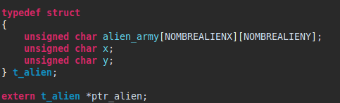

Jordan BERGER

https://github.com/joberger95

# Mode d'emploi

Télécharger le dépôt Git et lancer Atollic True Studio.
Ouvrir le projet et compiler. 
En parallèle, lancer depuis le terminal un screen de la sorte:
    
    screen /dev/ttyUSBx 115200
    x selon votre numéro de port (très souvent 0)

# Lancement du jeu  :alien:
Une fois exécuter, voici ce qui apparaît:

Comme indiqué, il suffit d'appuyer sur la barre espace pour lancer une partie.
Les touches suivantes :
- 'q' pour déplacment latéral gauche
- 'd' pour déplacement latéral droit
- 'space' pour tirer

# Difficultés
## Pointeurs

Plus par leur utilisation que leur compréhension, les pointeurs étaient une véritable plaie! 
Grâce aux cours délivrés et la mise en pratique, cette notion est bien plus claire. J'ai résolu ce problème d'utlisation tout simplement en me forçant à les utiliser. J'ai d'ailleurs lié le pointeur à une autre notion: les structures. Ce qui m'a permis de travailler les deux principes simultanément.

## Algorithmie

Prendre le temps de faire les choses une par une s'applique à la programmation et n'est pas toujours aisé à mettre en place. A vouloir aller vite, on se mélange dans les fonctions et objectifs. Il m'a donc fallu effectuer une classification des objectifs courts et moyens termes afin de ne pas me perdre dans le projet. 

Exemple d'objectifs court terme:
- afficher le vaisseau
- déplacer ce dernier

Exemple d'objectifs long terme
- suivre la règle du fonctionnel, propre, rapide
- ordonner chaque fonction
- appliquer les notions vues en cours (celle de #define nottament, à son application il m'a fallu revoir la notation d'une grosse partie des variables déjà existentes)

## Langage C

Le langage C est en lui-même une difficulté. Il a fallu lier les connaissances personnelles aux cours. Ajouter la difficulté du langage qui comporte bon nombre de spécifités telles que la taille des variables ou leur portée par exemple. Je n'ai d'ailleurs pas mener le projet à son terme (cad un jeu fonctionnel à 100%), mais j'aurai néanmoins appris et appliqué bon nombre de notions logicielles et embarquées.

# Notions

En plus de celles cîtées au-dessus, celles qui ont été découvertes:
- enum, struct, union
- volatile, extern
- pré-processeur, #typedef
- pointeurs

Celles qui ont été apprises et/ou appliquées:
- pointeurs
- boucles, instructions
- #define, #include, #typedef
- fichier .c et .h
- struct, extern, static

Celles qui ont été paufinées:
- boucles 
- fonctions
- types de variables

Et sûrement tout un tas que j'oublie! Une chose est sûre, je suis ressortit meilleur programmeur qu'à mon arrivé!

# Point(s) à privilégier

Je ne pense pas avoir de point(s) particulier dans mon projet. J'ai simplement tenté de mettre en oeuvre les cours, notions, réflexions (je pense nottament à la PEP20, dont j'ai essayé de tirer leçon et de l'appliquer au C -pas toujours avec succès,certes-) à mon projet. 

# Retour d'expérience

Globalement je suis satisfait de Space Invaders et des cours associés, malgré que je sois pas aller au bout de ce projet. Bien que je ne souhaite pas m'orienter dans la programmation pure et dure, ce sont des notions importantes dont j'ai tenté, et que je tente encore, de m'imprégner au mieux. M.POULAILLEAU Vincent (https://github.com/vpoulailleau) est pour beaucoup dans ma progression et motivation. Il a su apporté et transmettre ses connaissances et son savoir-faire , et cela a été une véritable bénédiction dans l'apprentissage de ce complexe langage.